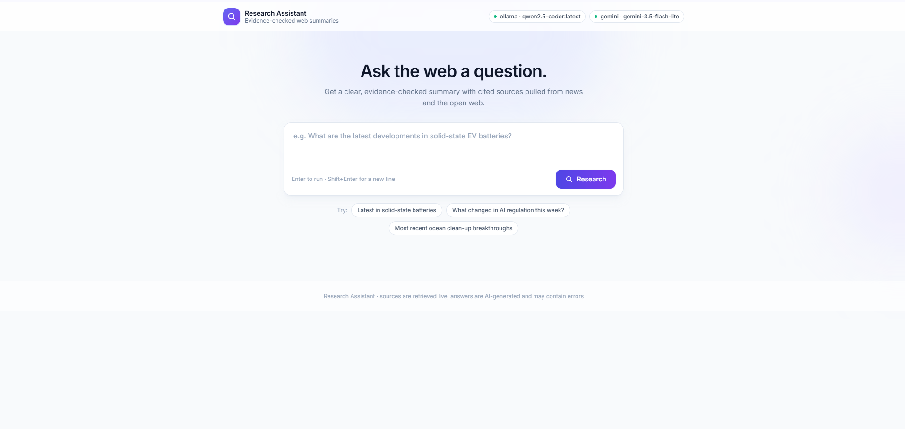

# Research Assistant

A production-ready research agent that converts a natural-language question into an evidence-checked web summary with cited sources pulled from news and the open web.

## Product overview

Research Assistant replaces the manual cycle of searching, skimming, and cross-checking tabs. A user types a question like "What changed in AI regulation this week?" or "Latest in solid-state batteries" and the agent plans a research strategy, searches across multiple sources, reads the top articles, evaluates evidence quality, and writes a summary where every key finding cites its source.

The default search path works without any account or API key (Google News RSS and public SearXNG instances). LLM providers are optional in the sense that the app falls back gracefully: with no LLM configured it still searches and lists sources; with a provider configured it plans, ranks, and writes full cited summaries.

## Screenshots

The screenshots below use public example queries and contain no personal data.


## Major features

- Natural-language questions with free-form phrasing and example prompts
- Multi-source search: Google News RSS (no key), SearXNG (no key), SerpApi (optional key)
- LLM research planning that chooses a web, news, or hybrid mode, freshness window, and source counts
- Multi-attempt research with self-refining queries when evidence is thin
- Article content extraction from the top sources for deeper evidence
- Evidence check: confidence level, enough-information verdict, missing details, and conflicting reports
- Cited answers: every key finding references a numbered source
- LLM provider fallback in order — Ollama, Gemini, then any OpenAI-compatible endpoint
- Heuristic relevance ranking (title/snippet overlap, authority hints, freshness) plus LLM relevance scoring
- Deduplication and freshness handling that never starves the answer (older sources are used when recent coverage is thin)
- Async job API with live progress events
- Single-file responsive web UI with provider status badges

## How the AI research works

1. The user submits a question from the web UI or CLI.
2. An LLM creates a research plan: research mode (`web`, `news`, or `hybrid`), search tools, search query, source counts, and freshness rule.
3. The search tools run against the configured providers (Google News RSS, SearXNG instances, and/or SerpApi) and results are deduplicated.
4. Results are ranked with a deterministic scorer and then re-ranked by an LLM relevance pass.
5. The top sources are fetched and their article text is extracted for evidence.
6. An evidence evaluator judges whether the sources are enough, how confident the answer can be, what is missing, and whether another search would help.
7. If evidence is thin, the agent refines the query and runs again (up to the configured attempt limit).
8. A final evidence check runs, then the agent writes a summary where each key finding cites its numbered source.

## Architecture

```
Browser / CLI
    │  question
    ▼
FastAPI (app.py)
    │  background job + progress polling
    ▼
Research pipeline (main.py)
    │
    ├─ make_research_plan()      LLM plan: mode, tools, freshness, counts
    ├─ search_web()              google_news · searxng · serpapi (+ fallback)
    ├─ process_results()         freshness + heuristic rank + LLM rank
    ├─ enrich_with_article_text() fetch and extract top articles
    ├─ evaluate_evidence()       confidence, enough-info, next-query
    └─ answer_with_evidence_check()  cited summary
    │
    ▼
tools/                          web/index.html
llm.py · google_news.py         single-file UI (Tailwind)
searxng_search.py · google_search.py
result_ranker.py · relevance_ranker.py
article_reader.py · evidence_evaluator.py
```

## Security and privacy

- Search providers are chosen for no-account access where possible; SearXNG and Google News RSS require no API keys.
- LLM API keys (Gemini, OpenAI/OpenAI-compatible) and SerpApi keys are read only on the server from environment variables — never from the browser.
- The web UI calls only the local API; the FastAPI layer is the single gateway to research jobs.
- Research jobs are tracked in an in-memory store; status is polled by job id without account data.
- Answers are AI-generated and marked as such in the UI footer.
- No user accounts, financial data, or private records are stored — every query is treated as a public research request.

**AI data processing notice** — Natural-language questions are sent to the configured LLM provider (Ollama, Google Gemini, or an OpenAI-compatible endpoint) for planning, ranking, and answer generation. Do not include passwords, card numbers, personal identifiers, or other secrets in your questions.

## Technology stack

- Python 3.10+ and FastAPI
- Uvicorn as the ASGI server
- requests, BeautifulSoup, and trafilatura for fetching and article extraction
- OpenAI-compatible SDK for LLM providers (Ollama, Gemini, OpenAI, Groq, OpenRouter, etc.)
- Single-file HTML/JavaScript frontend styled with Tailwind CSS
- Markdown system prompt for answer generation

## Local setup

Requirements:

- Python 3.10 or newer
- pip
- (optional) Ollama running locally, and/or a Gemini or OpenAI-compatible API key

```bash
git clone https://github.com/AmmarBinYasir489/ai-research-assistant.git
cd ai-research-assistant
python -m venv .venv
source .venv/bin/activate        # Windows: .venv\Scripts\activate
pip install -r requirements.txt
cp .env.example .env
uvicorn app:app --reload
```

Open http://127.0.0.1:8000.

You can also run the agent from the terminal:

```bash
python main.py
```

## Environment variables

Copy `.env.example` to `.env` and fill in values locally. Never commit `.env`.

| Variable | Required | Exposure | Purpose |
| --- | --- | --- | --- |
| `SEARCH_PROVIDER` | Yes | Server only | Default search provider (`google_news`, `searxng`, or `serpapi`) |
| `SEARCH_RESULT_COUNT` | No | Server only | Results to inspect per search (default 15) |
| `FINAL_SOURCE_COUNT` | No | Server only | Sources to keep and cite (default 5) |
| `MAX_ARTICLE_AGE_DAYS` | No | Server only | Freshness window in days (default 30) |
| `MAX_RESEARCH_ATTEMPTS` | No | Server only | Query-refinement attempts (default 2) |
| `SEARXNG_INSTANCES` | No | Server only | Comma-separated SearXNG instance URLs |
| `LLM_PROVIDERS` | No | Server only | Provider fallback order, e.g. `ollama,gemini` |
| `LLM_MODEL` | No | Server only | Default model name |
| `OLLAMA_MODEL` | No | Server only | Ollama model (default `qwen2.5-coder:latest`) |
| `OLLAMA_HOST` | No | Server only | Ollama host (default `localhost:11434`) |
| `GEMINI_API_KEY` | No | Server only | Google Gemini API key |
| `GEMINI_MODEL` | No | Server only | Gemini model (default `gemini-3.5-flash-lite`) |
| `OPENAI_API_KEY` | No | Server only | OpenAI or compatible endpoint key (Groq, OpenRouter, ...) |
| `OPENAI_MODEL` | No | Server only | Model for the OpenAI-compatible endpoint |
| `OPENAI_BASE_URL` | No | Server only | Base URL for the OpenAI-compatible endpoint |
| `SERPAPI_API_KEY` | No | Server only | SerpApi key for Google Search results |

Never expose `GEMINI_API_KEY`, `OPENAI_API_KEY`, or `SERPAPI_API_KEY` through a `NEXT_PUBLIC_`-style variable (there are none here — keys never reach the browser).

## Testing

There are no automated test suites yet. After setting up, verify the app manually:

```bash
uvicorn app:app --reload
```

Then try these from the UI or `python main.py`:

- "Latest in solid-state batteries"
- "What changed in AI regulation this week?"
- "Most recent ocean clean-up breakthroughs"
- A historical question (e.g. "Who invented the transistor?") to confirm older sources are used.

Run the small debug harness for a focused pipeline trace:

```bash
python scripts/debug_research.py
```

## Deployment

Research Assistant is a standard FastAPI application and runs on any Python host:

1. Set the production environment variables from `.env.example`.
2. Run with `uvicorn app:app --host 0.0.0.0 --port 8000` (consider multiple workers and a process manager).
3. Put it behind a reverse proxy (Nginx, Caddy, or a PaaS like Render/Fly.io) with TLS.
4. Verify `/`, `/health`, `/api/config`, and the `/api/research` endpoints.

## Limitations and disclaimer

- Public SearXNG instances and Google News RSS can be rate-limited or temporarily unavailable; a SerpApi key or self-hosted SearXNG improves reliability.
- AI research plans, rankings, and summaries can be incomplete or incorrect. Review important findings against the cited sources.
- The freshness window prefers recent sources for news questions but falls back to older ones when needed; undated results are never silently discarded.
- Answers are AI-generated and may contain errors; verify before relying on any information.
- This application is an information tool, not legal, medical, or financial advice.
- Research jobs and progress live in memory and reset when the server restarts.

## Documentation still needed

To complete the visual walkthrough without exposing any account or personal data, capture screenshots from the public example queries and add:

- `docs/images/landing.png`
- `docs/images/progress.png`
- `docs/images/evidence-check.png`
- `docs/images/answer-citations.png`
- `docs/images/sources-grid.png`
- optionally `docs/images/demo.gif` (about 20 seconds)
