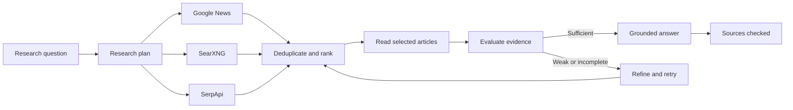

# AI Research Assistant

A source-grounded command-line research agent with pluggable search providers, evidence evaluation, freshness controls, and optional local synthesis through Ollama.

[](https://www.python.org/)
[](https://ollama.com/)

The assistant plans a search, gathers results from one or more providers, removes duplicates, ranks sources, reads selected articles, evaluates whether the evidence is sufficient, and produces an answer with numbered source links. If Ollama is unavailable, the search and source-reporting workflow continues without local synthesis.

## Highlights

- Search current news through Google News RSS without an account
- Search the broader web through configurable public SearXNG instances
- Use SerpApi when a Google Search API integration is available
- Plan research depth, freshness, query, and source count with an optional local model
- Rank results by relevance, source authority, and freshness
- Deduplicate results collected from multiple providers
- Read article text for stronger evidence than search snippets alone
- Evaluate evidence quality and report confidence or conflicting sources
- Retry research with an improved query when evidence is insufficient
- Produce answers with explicit numbered source references

## Research pipeline



## Search modes

| Provider | Best for | Credentials |
| --- | --- | --- |
| Google News RSS | Recent news and current events | None |
| SearXNG | General web research | None; public instances are configurable |
| SerpApi | Google Search results | `SERPAPI_API_KEY` |

Public SearXNG instances can be unavailable or rate-limited. Configure several instances if reliability matters.

## Project structure

```text
.
├── main.py                       Research planning and orchestration
├── prompts/
│   └── system_prompt.md          Grounding and citation rules
├── tools/
│   ├── article_reader.py         Article-text extraction
│   ├── evidence_evaluator.py     Evidence sufficiency and confidence
│   ├── google_news.py            Google News RSS search
│   ├── google_search.py          SerpApi integration
│   ├── result_ranker.py          Relevance, authority, and freshness scoring
│   └── searxng_search.py         SearXNG provider
└── scripts/
    └── debug_research.py
```

## Installation

### Prerequisites

- Python 3.10 or newer
- Optional Ollama installation for local planning, evaluation, and answer synthesis
- Optional SerpApi key

```bash
git clone https://github.com/AmmarBinYasir489/ai-research-assistnat.git
cd ai-research-assistnat

python -m venv .venv
```

Activate the environment:

```powershell
# Windows PowerShell
.\.venv\Scripts\Activate.ps1
```

```bash
# macOS or Linux
source .venv/bin/activate
```

Install dependencies:

```bash
pip install -r requirements.txt
```

## Configuration

Create `.env` in the project root:

```env
SEARCH_PROVIDER=google_news
SEARCH_RESULT_COUNT=15
FINAL_SOURCE_COUNT=5
MAX_ARTICLE_AGE_DAYS=30
MAX_RESEARCH_ATTEMPTS=2

# Optional local model
OLLAMA_MODEL=llama3.1

# Optional SerpApi provider
SERPAPI_API_KEY=

# Optional SearXNG provider
SEARXNG_INSTANCES=https://instance-one.example,https://instance-two.example
```

For local LLM synthesis:

```bash
ollama pull llama3.1
ollama serve
```

## Usage

```bash
python main.py
```

Enter a research question when prompted. The final response includes the evidence assessment and the source links that were checked.

## Grounding rules

The system prompt requires the assistant to:

- Base key findings on provided search evidence
- Cite only source numbers present in the research context
- Avoid inventing sources, titles, dates, or claims
- State clearly when the available evidence is weak or incomplete
- Surface important disagreements between sources

These controls reduce unsupported claims, but they do not guarantee factual correctness. Important conclusions should still be verified against primary sources.

## Limitations

- Search quality depends on the selected provider and its availability.
- Article extraction may fail on paywalls, client-rendered sites, or bot-protected pages.
- Authority scoring is heuristic and does not replace editorial judgment.
- A local language model can still misinterpret otherwise valid evidence.
